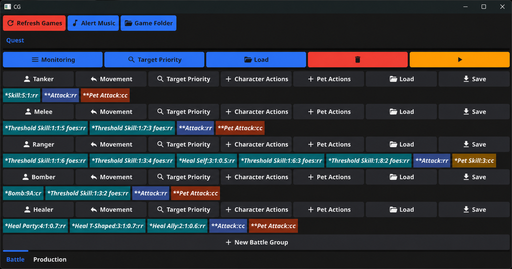

# CG

CG is a Windows desktop application for coordinating battle and production workflows across multiple compatible game-client windows. It is written in Go, uses Fyne for the UI, and integrates directly with Win32 window, pixel, input, process-memory, and file APIs.

> **繁體中文摘要：** CG 是一套 Windows 多開遊戲輔助工具，可設定戰鬥動作、移動方式、狀態檢查、生產流程與 MP3 提醒。程式依賴特定遊戲視窗、固定介面座標、記憶體位置及 Big5 log 格式；使用前請先閱讀下方的相容性與初次設定說明。

CG is designed for operator-supervised automation. Compatibility depends on the exact game client and Windows environment, and is not detected automatically.



## Features

- Discover and refresh multiple compatible game windows.
- Group selected windows for coordinated battle workflows.
- Configure ordered character and pet actions, conditions, jumps, and targets.
- Load and save battle action configurations as `.ac` files.
- Select optional movement patterns driven by in-game map coordinates.
- Monitor teleport, resource, activity, verification, health, mana, and inventory conditions.
- Assist with material preparation, item production, and inventory organization.
- Play a repeating MP3 alert when operator attention is required.
- Recognize both standard and supported Sandbox-style game window classes.

## Platform and Compatibility

CG is Windows-only. The current implementation assumes:

- A compatible game window class matching `Blue` or `Sandbox:CG<digits>:Blue`.
- A 1920×1080 desktop with Windows display scaling set to 100%.
- A 640×480 game client coordinate layout.
- Stable UI positions, colors, keyboard shortcuts, and process-memory addresses.
- Big5-encoded game logs stored below a selected `Log` directory.
- Permission to inspect the game window and read its process memory.

Other display resolutions or Windows display scaling percentages have not been validated and are not currently supported. A game client update, a different UI layout, insufficient process permissions, or an unexpected log format can prevent automation from working correctly. Test changes with supervision before relying on long-running workflows.

## Requirements

To run a packaged build:

- Windows x64.
- One or more compatible game-client windows.
- A game directory containing readable logs when log-based checkers are used.
- An MP3 file when audible alerts are used.

To build from source:

- Go 1.21.x.
- CGO enabled.
- MSYS2 MinGW-w64 GCC available on `PATH`.
- PowerShell.

See the [Windows build guide](docs/build-windows.md) for installation and troubleshooting details.

## Quick Start from Source

Clone the repository and run the application from PowerShell:

```powershell
git clone https://github.com/g70245/cg.git
Set-Location cg
go run .
```

For a repeatable developer build:

```powershell
.\scripts\build.ps1
```

The build script verifies the required tools and dependencies, then writes the executable to `dist\cg.exe`. When dependencies are already available locally:

```powershell
.\scripts\build.ps1 -SkipDependencyDownload
```

## First-Run Setup

1. Start the compatible game clients before launching CG.
2. Launch CG and use **Refresh** if the expected windows are not listed.
3. Select **Game Directory** and choose the client root containing the `Log` subdirectory.
4. Select **Alert Music** and choose an MP3 file if audible alerts are needed.
5. Create a battle group or production worker for the desired game windows.
6. Configure actions and checkers before starting a workflow.

Log-dependent battle and production checks will not start unless the selected game directory contains a readable `Log` directory. If multiple installations or Sandbox environments are in use, select the directory associated with the current client instance.

## Battle Workflow

The Battle tab supports grouped game windows and configurable character and pet action sequences. Actions may include attacks, skills, healing, defensive behavior, movement, conditional thresholds, success/failure control units, and jumps between configured steps.

Use the checker menu to enable only the monitoring required for the current workflow. Battle action configurations can be saved to and loaded from `.ac` files. These files are JSON-based but currently have no formal schema version, so keep backups before editing them outside CG.

## Production Workflow

The Produce tab creates a worker for each selected game window. Production automation can prepare materials, interact with the production UI, wait for completion, and reorganize inventory slots. It relies on fixed client coordinates and pixel colors, so supervise the first run after any client or display change.

## Alerts

CG uses the selected MP3 as a repeating operator alert. Alerts may be triggered by configured battle, inventory, verification, resource, or production conditions. Press `Ctrl+0` to stop an active alert.

## Test and Quality Checks

Run the repository checks from PowerShell:

```powershell
go test ./...
go vet ./...
```

The automated tests cover selected pure-logic and filesystem boundaries. They do not interact with a live game window, process memory, audio device, or real user log directory. Live battle, movement, production, audio, and UI behavior still require supervised manual testing.

Windows CI runs the verified build path, tests, and vet checks for changes targeting `dev` or `main`.

## Package a Windows Release

Create a Fyne release package with the repository-owned icon and application ID:

```powershell
.\scripts\package.ps1
```

To embed a semantic application version:

```powershell
.\scripts\package.ps1 -AppVersion 1.0.0
```

The packaged executable is written to `dist\CG.exe`. The script pins Fyne CLI `v1.7.2` and supplies the required application ID `com.github.g70245.cg`.

## Project Structure

```text
container/        Fyne UI and workflow coordination
game/             Shared game operations, detection, logs, and instances
game/battle/      Battle state machine, targeting, movement, and workers
game/production/  Production workflow and workers
internal/         Win32, process-memory, color, and filesystem primitives
utils/            Audio alerts and diagnostic helpers
scripts/          Windows build and packaging commands
docs/             Architecture and Windows build documentation
```

For a detailed package map, runtime flow, compatibility assumptions, and known technical debt, read [Architecture](docs/architecture.md).

## Development Guidelines

- Keep UI composition in `container/`, game behavior in `game/`, and Windows/file primitives in `internal/`.
- Keep changes focused and avoid broad refactors without a concrete need.
- Run `gofmt` on changed Go files.
- Do not add tests that depend on a live game, process memory, or personal log directories.
- Run `go test ./...` and `go vet ./...` before review.
- Do not commit accounts, machine-specific game paths, logs, credentials, or other personal data.

Repository-specific AI-assisted development rules and task state live under `.ai/`.

## Documentation

- [Architecture and technical debt](docs/architecture.md)
- [Windows build and packaging guide](docs/build-windows.md)

## License

This project is available under the [MIT License](LICENSE).
