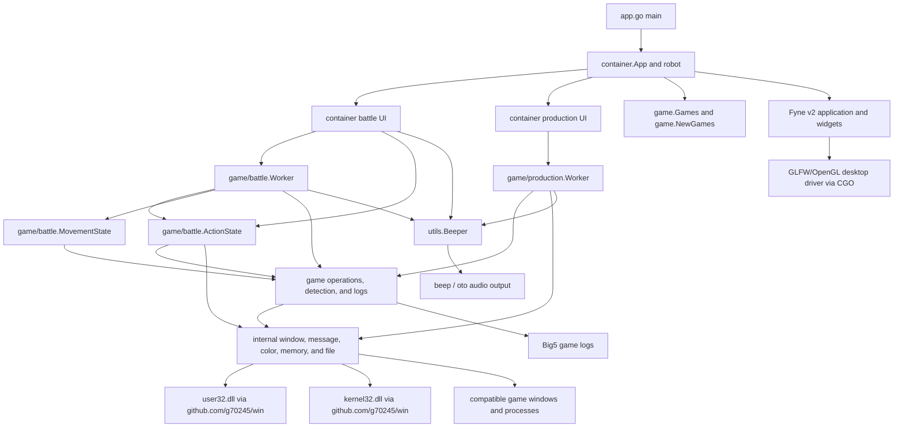
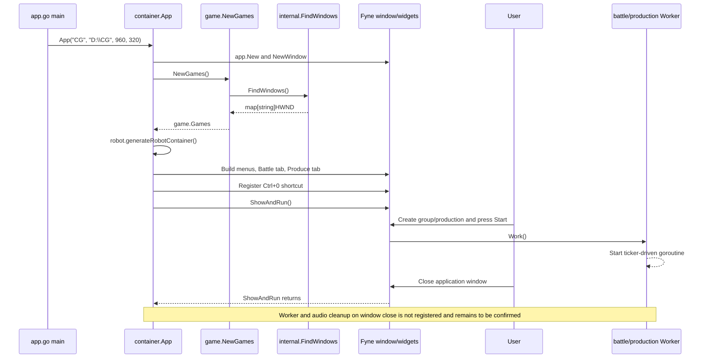
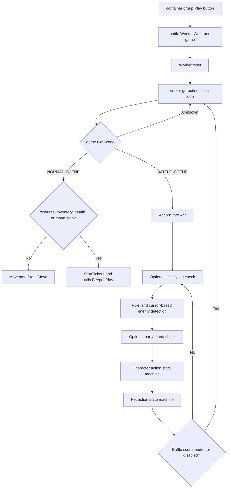
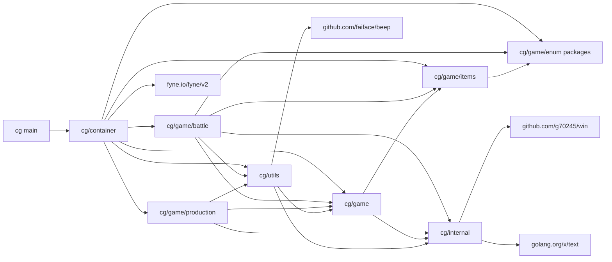

# Architecture

## 1. Project Overview

`cg` is a Windows-only desktop automation application for controlling multiple compatible game-client windows. It provides a Fyne GUI for discovering game windows, grouping them, configuring ordered battle actions, moving characters between battles, monitoring selected game conditions, and assisting with repetitive item production.

The intended users are operators who run one or more compatible game clients on the same Windows machine and want semi-automated battle and production workflows. The repository does not identify the game by name, so game-specific claims in this document are limited to behavior visible in the code.

The application interacts with the game through four mechanisms:

- It enumerates windows whose class matches `^Blue$|^Sandbox:CG\d+:Blue$`.
- It sends mouse and keyboard window messages to discovered `HWND` values.
- It samples pixels at fixed client coordinates to infer UI and battle state.
- It reads fixed process-memory addresses and parses recent Big5-encoded game logs for selected checks.

The main features currently implemented are:

- Multi-window discovery, aliasing, refresh, and grouping.
- Configurable character and pet battle-action state machines.
- Optional movement patterns based on process-memory map coordinates.
- Inventory, teleport, resource, activity, verification, health, and mana checks.
- Semi-automatic material preparation, production, and inventory compaction.
- Repeating MP3 alerts when operator attention is required.
- JSON-based loading and saving of battle action configurations as `.ac` files.

The application targets Windows x64. Its primary technologies are Go, Fyne, CGO-backed GLFW/OpenGL integration, Win32 APIs, and the `beep` audio stack.

## 2. Technology Stack and External Dependencies

### 2.1 Go module dependencies

`go.mod` declares module `cg`, Go `1.21.1`, and the following direct dependencies.

| Dependency | Declared version | Actual use |
| --- | --- | --- |
| `fyne.io/fyne/v2` | `v2.4.0` | Application/window lifecycle, containers, widgets, dialogs, file/folder selection, data binding, themes, canvas objects, and desktop shortcuts. |
| `github.com/faiface/beep` | `v1.1.0` | MP3 decoding, looping playback, playback control, and speaker output in `utils/beeper.go`. |
| `github.com/g70245/win` | `v0.0.0-20250117095612-913c9f118832` | Win32 types and calls for window discovery, messages, device contexts, pixels, and process-memory access. |
| `golang.org/x/exp` | `v0.0.0-20230905200255-921286631fa9` | `maps.Keys`, `maps.Values`, and `slices.Contains` in game collection, UI selection, and diagnostic code. |
| `golang.org/x/text` | `v0.13.0` | Big5 decoding for game logs and strings read from game memory. |

Important indirect dependencies include:

| Dependency group | Actual role |
| --- | --- |
| `github.com/go-gl/gl` and `github.com/go-gl/glfw/v3.3/glfw` | Fyne's desktop rendering and window driver. The Windows GLFW package contains CGO files. |
| `github.com/hajimehoshi/go-mp3` and `github.com/hajimehoshi/oto` | MP3 decoding and Windows audio output beneath `github.com/faiface/beep`. |
| Fyne rendering, text, image, storage, and systray modules | Transitive implementation details of the Fyne UI stack. |

`go.sum` pins checksums for direct and transitive Go modules. No `replace` directives or private module proxies are configured in the repository.

### 2.2 Operating-system dependencies

| Dependency | Usage | Lifecycle or permission notes |
| --- | --- | --- |
| Windows desktop APIs | The application is not portable because it relies on Windows window handles and system calls. | Supported Windows versions are **To be confirmed**. |
| `user32.dll` through `github.com/g70245/win` | `EnumChildWindows`, `GetClassNameW`, `GetWindowThreadProcessId`, `GetDC`, `GetPixel`, `ReleaseDC`, `PostMessageW`, and virtual-key mapping. | The code sends messages directly to other process windows. |
| `kernel32.dll` through `github.com/g70245/win` | `OpenProcess` and `ReadProcessMemory`. | `internal/readMemory` requests access mask `0x1F0FFF`; required privileges and cross-integrity behavior are **To be confirmed**. |
| Windows graphics stack | Used indirectly by Fyne's GLFW/OpenGL desktop driver. | Exact runtime driver requirements are managed by Fyne and are not documented in this repository. |
| Windows audio stack | Used indirectly by `beep` through `oto`. | Audio device requirements and failure behavior are **To be confirmed**. |
| Compatible game client | Supplies matching windows, fixed-size UI, memory layout, and Big5 logs. | Client name, supported versions, permissions, and layout assumptions are **To be confirmed**. |

### 2.3 Build-tool dependencies

| Tool | Confirmed requirement |
| --- | --- |
| Go | `go.mod` declares `1.21.1`; repository documentation supports the Go `1.21.x` line and records verification with `1.21.13`. |
| CGO | The verified environment reports `CGO_ENABLED=1`. It is required by the Windows GLFW package used by Fyne. |
| GCC | Required to compile the CGO-backed Fyne desktop stack. The documented and verified compiler is MSYS2 MinGW-w64 GCC `16.1.0`. |
| MSYS2 MinGW-w64 | The repository-documented provider of the Windows x64 GCC toolchain. |
| PowerShell | Required by `scripts/build.ps1` and `scripts/package.ps1`. |
| Fyne CLI | `scripts/package.ps1` invokes `fyne.io/tools/cmd/fyne@v1.7.2` through `go run`; it is not an application runtime dependency. |

### 2.4 Runtime dependencies

The built application requires Windows, a compatible game client, and access to an audio device when alerts are used. Battle and production automation depend on the game client retaining the expected window class, 640×480 client-coordinate layout, colors, keyboard shortcuts, memory addresses, and Big5 log behavior. These compatibility constraints are encoded as constants rather than negotiated at runtime.

## 3. Repository Structure

```text
cg/
├── app.go                         # Executable entry point
├── go.mod / go.sum                # Go module definition and checksums
├── container/                     # Fyne UI and workflow coordination
├── game/
│   ├── battle/                    # Battle state machine, detection, movement, workers
│   ├── production/                # Production workflow, detection, workers
│   ├── enum/                      # UI/domain enumerations
│   ├── items/                     # Known item definitions and colors
│   └── *.go                       # Shared game operations, detection, logs, instances
├── internal/                      # Win32, memory, color, and file primitives
├── utils/                         # Audio alerts and diagnostic helpers
├── scripts/                       # Windows build and Fyne packaging scripts
├── docs/                          # Build, progress, and architecture documentation
├── .codex/skills/session-handoff/ # Project-local Codex handoff workflow
├── app.png                        # Fyne packaging icon
├── example.png                    # Example UI screenshot
└── dist/                          # Ignored generated executables
```

| Path | Responsibility | Notes |
| --- | --- | --- |
| `app.go` | Calls `container.App`. | Hard-codes title `CG`, initial directory `D:\CG`, and window size `960×320`. |
| `container/main.go` | Creates the Fyne application, global window, root tabs, refresh controls, path/audio selectors, and shutdown closures used during refresh. | Contains package-level `window` and `r`. |
| `container/battle.go` | Builds battle-group UI, edits action sequences, loads/saves `.ac` JSON, creates workers, and controls battle/checker lifecycles. | The largest UI file and a significant coordination point. |
| `container/production.go` | Builds production UI and creates/removes one production worker per selected game. | Directly controls concrete `production.Worker` values. |
| `game/instance.go` | Represents discovered windows as `Games map[string]win.HWND`. | Initial keys are decimal handle strings; UI aliases mutate this map in memory only. |
| `game/operation.go` | Provides timed, game-level input operations such as opening windows, using skills, and using items. | Delegates to `internal/message.go`. |
| `game/detection.go` | Shared scene, inventory, item, map-name, and map-position detection. | Uses fixed pixels and fixed memory addresses. |
| `game/log.go` | Searches recent Big5 game logs for time-bounded phrases. | Does not expose errors to callers. |
| `game/battle/` | Implements battle actions, control units, target selection, health/mana checks, movement, and worker scheduling. | Dominated by `ActionState` and `Worker`. |
| `game/production/` | Implements material unpacking, production-state detection, inventory tidying, and worker scheduling. | Operates by fixed coordinates and colors. |
| `game/enum/` | Defines action, role, target-order, movement, ratio, offset, threshold, and control-unit values. | Primarily feeds UI selectors and state-machine configuration. |
| `game/items/` | Defines known bomb and potion colors. | Item detection is pixel-color based. |
| `internal/window.go` | Enumerates game windows by class-name regex. | Calls Win32 through `github.com/g70245/win`. |
| `internal/message.go` | Sends mouse and keyboard window messages with fixed sleeps. | Uses a dot import of the Win32 package. |
| `internal/color.go` | Reads a pixel from a target window device context. | Pairs `GetDC` with `ReleaseDC`. |
| `internal/memory.go` | Reads strings and `float32` values from another process. | Opens a process on every read and does not close the returned handle. |
| `internal/file.go` | Finds the newest log file, reads trailing lines, and decodes Big5. | Uses panic and ignored errors on several failure paths. |
| `utils/beeper.go` | Owns global looping MP3 playback. | Uses a goroutine and unbuffered control channels. |
| `utils/helpers.go` | Contains ad hoc diagnostics for coordinates, colors, handles, and goroutines. | Most helpers are unexported and are not called by the application entry path. |
| `scripts/build.ps1` | Verifies Go/GCC/modules and builds `dist\cg.exe`. | Supports skipping module download. |
| `scripts/package.ps1` | Runs pinned Fyne packaging with the required app ID and moves `CG.exe` to `dist\CG.exe`. | Uses `com.github.g70245.cg`. |
| `.github/workflows/windows-ci.yml` | Runs the verified Windows build, package compilation checks, and vetting on GitHub Actions. | Uses `windows-2022`, Go `1.21.x`, CGO, and GCC. |
| `app.png` | Repository-owned package icon. | Used only by `scripts/package.ps1`. |
| `example.png` | Screenshot of the battle UI. | Referenced by `README.md`; not embedded into the executable. |
| `dist/` | Generated build output. | `*.exe` is ignored by `.gitignore`. |

There are no repository configuration files for standalone linting, installers, runtime settings, or persisted user preferences. GitHub Actions CI is configured in `.github/workflows/windows-ci.yml`.

## 4. Overall System Architecture

The current architecture is package-layered by directory, but the boundaries are pragmatic rather than interface-driven. `container` is both the UI layer and the application coordinator. `game/battle` and `game/production` contain long-running workflows. `game` provides shared game semantics. `internal` provides low-level OS and file primitives.



### Current layer responsibilities

- **UI and coordination:** `container` constructs Fyne objects, stores application-global state, creates concrete workers, edits worker state directly, and starts/stops workflows from callbacks.
- **Workflow execution:** `game/battle.Worker` and `game/production.Worker` run ticker-driven goroutines. `game/battle.ActionState` is a configurable state machine executed during battle scenes.
- **Game integration:** `game` and its subpackages translate game concepts into fixed coordinates, colors, keys, timings, phrases, and memory offsets.
- **Native integration:** `internal` translates operations into Win32 calls and local filesystem reads.
- **Configuration and state:** Runtime state is held in package globals, maps, worker structs, pointers, and Fyne widgets. Battle action configuration alone can be persisted as JSON `.ac` files.
- **Data access:** The application reads game window pixels, game process memory, game log files, MP3 files, and `.ac` configuration files. It writes `.ac` configuration files and standard-library log output.
- **Background work:** Battle workers, production workers, dialog sequencing, delayed configuration notices, and audio playback use goroutines.

## 5. Startup Flow

### 5.1 Confirmed sequence

1. `main.main` calls `container.App("CG", "D:\\CG", 960, 320)`.
2. `container.App` calls `app.New`, creates a Fyne window, and resizes it.
3. It initializes the package-global `robot`:
   - `game.NewGames()` calls `internal.FindWindows()`.
   - `internal.FindWindows()` enumerates child windows under desktop handle `0` and keeps class names matching `CLASS_PATTERN`.
   - `gameDir` points to the local `gameDir` argument; `actionDir` copies its initial value.
4. `robot.generateRobotContainer` creates empty Battle and Produce tabs for the discovered games. No battle or production worker goroutine starts at this point.
5. `container.App` creates Refresh, Alert Music, and Game Directory controls.
6. It registers `Ctrl+0` as a desktop shortcut that calls `utils.Beeper.Stop()`.
7. It sets the root content and calls `window.ShowAndRun()`, which owns the Fyne event loop until the window exits.



### 5.2 Configuration initialization

There is no general configuration file or environment-variable loader. The initial game/action directory is hard-coded in `app.go`. The user may replace `*r.gameDir` through a folder dialog, but `r.actionDir` remains the original `D:\CG` value. Battle action settings are loaded only when the user selects an `.ac` file. Audio is initialized only after the user selects an MP3 file.

### 5.3 Background startup and shutdown

Workers start only through Play buttons. `Work()` resets existing tickers and starts a goroutine. Refresh explicitly calls `r.close()`, which removes UI objects, closes battle-group stop channels, and signals production workers. Deleting a battle group or production selection also signals its workers.

There is no `SetCloseIntercept`, application shutdown callback, or deferred call to `r.close()`/`utils.Beeper.Close()` around `ShowAndRun`. Therefore explicit cleanup on normal window close is not present in repository code. Fyne's own cleanup behavior is external to the repository; application-worker cleanup remains **To be confirmed**.

## 6. Core Functional Flows

### 6.1 Game discovery and refresh

**Trigger:** Application startup or confirmation in the Refresh dialog.

**Call chain:**

```text
container.App / robot.refresh
  -> game.NewGames
  -> internal.FindWindows
  -> win.EnumChildWindows
  -> win.GetClassName
  -> game.Games.AddGames (refresh only)
  -> robot.generateRobotContainer
```

`internal.FindWindows` converts each matching `HWND` to a decimal string key. `Games.AddGames` preserves aliases for handles that still exist, removes missing handles, and adds newly discovered handles. Refresh first removes current UI content and calls the existing `r.close`, then rebuilds tabs from the updated map.

Failure handling is minimal: Win32 return values are not checked, regex compilation occurs during each enumeration callback, and an empty result produces an application with no selectable game windows. No error is shown to the user.

**Output:** Rebuilt Battle and Produce tabs backed by the current in-memory `game.Games` map.

### 6.2 Battle group configuration and execution

**Trigger:** The user creates a group, selects windows, configures actions/checkers/movement, and presses the group Play button.

**Configuration flow:**

1. `newBattleContainer` opens a Fyne dialog containing a group name and `CheckGroup` of `Games.GetSortedKeys()`.
2. `newBatttleGroupContainer` creates one `game/battle.Worker` per selected `HWND`. Workers share:
   - `sharedStopChan`
   - `sharedWaitGroup`
   - `sharedInventoryStatus`
   - a selected `manaChecker` string
3. `generateGameWidget` lets the user mutate each worker's `MovementState.Mode`, `CustomEnemyOrder`, and `ActionState`.
4. Character and pet actions are appended in UI order. Optional parameters, offsets, thresholds, success/failure `ControlUnit` values, and jump IDs are collected through sequenced dialogs.
5. Save marshals exported `ActionState` fields as JSON; load unmarshals JSON and restores runtime-only `HWND`, `GameDir`, and `ManaChecker` references.

**Execution flow:**



`ActionState` transforms configured action records into mouse/key operations. It detects stages and results by pixels, changes action IDs according to `StartOver`, `Continue`, `Repeat`, or `Jump`, and resets IDs after battle. Targeting and healing inspect fixed player/enemy coordinates. Movement reads current map coordinates from process memory and clicks a point around the 640×480 center.

Independent ticker cases check inventory, map/log teleport state, resource phrases, and verification phrases. When a stop condition occurs, tickers stop and audio is requested.

**Failure points and handling:**

- Missing pixel pivots or action windows generally produce `log.Printf` messages and state-machine failure transitions.
- Invalid or stale memory addresses produce no explicit error; the Win32 wrapper result is consumed directly.
- Missing/invalid log paths may panic in `internal/file.go`.
- MP3 playback may block or terminate the process depending on initialization and decoder errors.
- Load/save dialog errors are mostly ignored; save failures call `log.Fatalf`, terminating the process.
- A stopped ticker does not itself terminate the goroutine; the worker remains blocked in `select` until a stop-channel event or a ticker is reset.

**Output:** Window messages sent to game clients, logs written to the process logger, optional audio alerts, and action tags/configuration changes shown in the Fyne UI.

### 6.3 Production workflow

**Trigger:** The user selects games under New Production and presses a worker Play button.

**Call chain:**

```text
container.newProductionContainer
  -> newProductionWorkerContainer
  -> production.NewWorker
  -> production.Worker.Work
  -> prepareMaterials
  -> produce
  -> tidyInventory
```

`production.Worker.Work` starts four tickers:

- A 400 ms work ticker runs the production cycle unless `GatheringMode` is enabled.
- A 2 s log checker calls `game.IsProductionStatusOK`.
- A 16 s inventory checker calls `game.IsInventoryFullWithoutClosingAllWindows`.
- A 4 s audible-cue checker alerts when `ManualMode` is set.

`prepareMaterials` opens the inventory, finds the inventory pivot by pixel color, and double-clicks material stacks from the bottom row into empty top-row slots. `produce` finds the production inventory, transfers candidate inputs, checks the production button color, starts production, and polls until the success pixel appears. `tidyInventory` compacts occupied slots leftward across two rows.

Failures generally set `ManualMode = true` and log a message. A later audible-cue tick stops all tickers and calls `utils.Beeper.Play()`. Inventory-full and log-check failures stop tickers immediately and alert. `produce` has no timeout while waiting for `isProducingSuccessful`; if the expected pixel never appears, that worker goroutine remains in the polling loop until the condition changes.

**Output:** Game-window input, process logs, optional audio alerts, and Play/Stop icon changes initiated by the UI callback. Worker failures do not update the button icon automatically.

### 6.4 Alert music selection and playback

**Trigger:** The user selects an MP3 file, or a worker detects a condition requiring attention.

`container.App` calls `utils.Beeper.Init(path)`. `Init` starts a goroutine, closes any prior player, opens and decodes the MP3, initializes the global speaker, and loops on unbuffered pause/done channels. `Play`, `Stop`, and `Close` send control values to those channels. `Ctrl+0` invokes `Stop`.

Open/decode errors call `log.Fatal`. `Beeper.Play()` does not check `isReady`; calling it before the playback goroutine is ready leaves the caller blocked on `pausedChan`. Access to `isReady` and channel lifecycle is not synchronized.

## 7. Package and Module Dependencies



Go's compiler-enforced import graph is acyclic. The current graph has no import cycle, but several coupling characteristics matter:

- `container` depends directly on concrete `battle.Worker`, `production.Worker`, `ActionState`, enum packages, item definitions, `utils.Beeper`, and Fyne. UI callbacks directly mutate worker fields.
- `game/battle` combines scheduling, state-machine policy, detection, input operations, log checking, audio alerts, and group coordination.
- `game/production` combines scheduling, UI-state inference, input operations, and alert policy.
- `game` depends on `internal` directly; there are no interfaces separating game behavior from Win32, memory, pixels, time, or filesystem access.
- `utils` depends upward on `game` and `internal` because `utils/helpers.go` contains game diagnostics. This does not create a cycle today, but it broadens the utility package's dependency surface.
- Windows integration is physically isolated in `internal`, but its concrete functions are called directly. It is a package boundary, not a replaceable abstraction.

## 8. Key Types and Components

| Name | Package | Responsibility | Main dependencies | Main callers | Notes |
| --- | --- | --- | --- | --- | --- |
| `robot` | `container` | Holds root UI, directories, dimensions, discovered games, and a refresh cleanup closure. | Fyne, `game.Games` | `container.App` | Stored in package-global `r`; not persisted. |
| `BattleGroups` | `container` | Tracks group stop channels for refresh cleanup. | `chan bool` | `newBattleContainer`, `robot.generateRobotContainer` | `stopAll` closes channels without tracking goroutine completion. |
| `ProductionWorkers` | `container` | Tracks production UI containers and stop channels by game key. | Fyne containers, `chan bool` | `newProductionContainer`, `robot.generateRobotContainer` | UI management and worker lifecycle are combined. |
| `Games` | `game` | Maps aliases/handle strings to `win.HWND`; supports refresh and selection. | `internal.FindWindows`, `x/exp/maps` | `container`, worker factories | Alias state exists only in memory. |
| `CheckTarget` | `game` | Represents a client-coordinate pixel target and expected color. | `win.COLORREF` | Detection and action code | Core representation for fixed-layout automation. |
| `ActionState` | `game/battle` | Stores ordered character/pet actions and executes the battle state machines. | `game`, enums, items, `internal`, logs, `utils.Beeper` | `battle.Worker`, `container/battle.go` | Mixes persisted configuration with transient execution state. |
| `CharacterAction` | `game/battle` | Configures one character action and its control transitions. | Action/offset/threshold/control enums | `ActionState`, UI JSON load/save | Exported fields are serialized without an explicit version field. |
| `PetAction` | `game/battle` | Configures one pet action and its control transitions. | Action/offset/threshold/control enums | `ActionState`, UI JSON load/save | Same compatibility concern as `CharacterAction`. |
| `Worker` | `game/battle` | Schedules battle, movement, inventory, and log/memory checks for one window. | `ActionState`, `MovementState`, tickers, shared pointers/channel/WaitGroup | `container/battle.go` | `Work` can start a new goroutine each time it is called. |
| `Workers` | `game/battle` | Slice of battle workers. | `Worker` | Battle-group UI | Workers are values; UI takes addresses of slice elements. |
| `MovementState` | `game/battle` | Chooses a movement click based on mode, origin, and current memory position. | `game.GetCurrentGamePos`, `internal.LeftClick` | `battle.Worker` | `origin` and `hWnd` are unexported runtime state. |
| `Worker` | `game/production` | Schedules production, log, inventory, and manual-attention checks for one window. | `game`, `internal`, tickers, `utils.Beeper` | `container/production.go` | `ManualMode` and `GatheringMode` are shared mutable fields. |
| `Item` and `Bombs` | `game/items` | Associate item labels with detection colors. | `enum.GenericEnum`, `win.COLORREF` | Battle action configuration and item lookup | Potion is represented only by a color constant. |
| `GenericEnum[T]` | `game/enum` | Converts typed enum lists into UI option strings. | `fmt.Sprint` | Battle UI and item definitions | Minimal generic UI adapter. |
| `beeper` / `Beeper` | `utils` | Own global looping MP3 playback and control channels. | `beep`, `mp3`, `speaker` | UI, battle workers, production workers | Global mutable singleton with unsynchronized state. |

There are no repository/service interfaces, controllers, or repository objects in the conventional application-architecture sense. File, memory, and Win32 access are package functions.

## 9. State Management and Lifecycle

### 9.1 Global and UI state

- `container.window` and `container.r` are package globals initialized by `container.App`.
- `utils.Beeper` is a package-global singleton initialized by `utils.init`.
- Detection targets, colors, option lists, and item lists are package-level variables/constants.
- Fyne widgets retain selection, icon, text, and dialog state. UI callbacks directly update workers and the `Games` map.
- No state is persisted automatically. Aliases, selected directories, enabled checkers, groups, and production settings are lost on exit.

### 9.2 Configuration state

- `r.gameDir` is a pointer to the `gameDir` variable local to `container.App`; workers share that pointer and observe folder-dialog changes.
- `r.actionDir` is a string copied at startup and does not change with the Game Directory selector.
- `ActionState` JSON saves exported action slices and fields. Runtime fields use `json:"-"` or are unexported.
- Loading a group setting reuses one unmarshaled `ActionState` value across assignments, then restores per-worker handles and shared pointers.
- There is no schema version, validation pass, migration policy, or atomic write for `.ac` files.

### 9.3 Goroutines, channels, and timers

| Source | Lifecycle |
| --- | --- |
| `battle.Worker.Work` | Starts one select-loop goroutine and resets three reusable tickers. Exits only after receiving from `sharedStopChan`; stopped tickers leave it blocked. |
| `production.Worker.Work` | Starts one select-loop goroutine and resets four reusable tickers. Exits after receiving from its stop channel. |
| `utils.Beeper.Init` | Starts an audio-control goroutine that exits after receiving from `doneChan`. |
| `activateDialogs` | Starts a goroutine that waits for UI dialog-close signals on `selectorDialogEnableChan`; it also starts a final drain goroutine. |
| `notify*Config` | Starts a goroutine, sleeps 200 ms, then shows a Fyne information dialog. |

### 9.4 Concurrency risks

The following are evidence-based risk assessments; actual failure frequency requires runtime testing.

- **Inference — data races:** UI callbacks write checker flags, movement mode, action state, directory pointers, and beeper state while worker/audio goroutines read or write them without mutexes or atomics.
- **Inference — duplicate workers:** Repeated `Work()` calls can create multiple goroutines selecting on the same ticker fields and stop channel. The UI icon reduces normal accidental repetition but does not enforce a worker lifecycle state.
- **Inference — goroutine retention:** Calling `StopTickers` stops events but does not terminate worker goroutines. They remain blocked until a stop-channel signal or later ticker reset.
- **Inference — dialog goroutine retention:** `activateDialogs` depends on every expected dialog closure sending to the channel. Unexpected UI lifecycle paths may leave a goroutine waiting.
- `sharedWaitGroup.Add(1)` occurs inside a worker goroutine while other workers may call `Wait()`. Go's `WaitGroup` contract requires careful ordering; current group coordination has no higher-level synchronization.
- `sharedInventoryStatus` is a plain shared `*bool` accessed by multiple battle workers.

### 9.5 Fyne thread model

Most widget changes occur in Fyne callbacks. Worker goroutines do not directly update widgets. However, `notifyBeeperConfig`, `notifyLogConfig`, and `notifyBeeperAndLogConfig` create/show dialogs from background goroutines after sleeping. Whether this is safe under the exact Fyne `v2.4.0` driver behavior is **To be confirmed**; it should not be described as guaranteed UI-thread-safe from repository evidence alone.

### 9.6 Native and application resource cleanup

- `internal.GetColor` correctly calls `ReleaseDC` after `GetDC`.
- MP3 streamers and `speaker.Clear` are deferred inside the beeper goroutine.
- Opened `.ac` files are closed with `defer` after a successful `os.Open`.
- `internal.readMemory` does not call `win.CloseHandle` after `win.OpenProcess`, so repeated memory reads leak process handles until process exit.
- Tickers are stopped on worker-goroutine exit, but the ticker objects and worker goroutines can remain reachable through UI structures.
- Normal window close has no explicit application-level worker/audio shutdown hook.

## 10. Error Handling and Logging

### 10.1 Current behavior

The project uses several inconsistent error strategies:

- Detection and state-machine failures usually return `bool` and produce `log.Printf` output.
- Many Win32 return values and errors are ignored.
- File dialog callback errors are ignored.
- JSON/file load failures are silently ignored.
- `.ac` write failure uses `log.Fatalf`, which terminates the process.
- MP3 open/decode failure uses `log.Fatal` inside the audio goroutine, also terminating the process.
- Missing game log files can reach `panic("Cannot open file")`.
- Big5 conversion, `Seek`, `Read`, `Stat`, and memory-read errors are ignored.

Fyne information dialogs are used only as pre-operation reminders for missing audio/log configuration. Operational worker failures are logged and may trigger audio; they are not presented as structured UI errors.

The standard `log` package writes to its default destination, normally standard error. The repository does not configure a log file, structured logging, rotation, severity fields, or redaction.

### 10.2 Important error boundaries

| Boundary | Current handling | Consequence |
| --- | --- | --- |
| Window enumeration and class lookup | Return values ignored | Missing games appear as an empty list without diagnostics. |
| Message injection | `PostMessage` results ignored | Failed input is inferred indirectly from pixels, if at all. |
| Pixel/DC reads | `GetPixel` result consumed directly | Invalid handles/DCs can resemble unexpected colors. |
| Process open/read | Errors ignored; data returned directly | Incorrect state, excessive access failures, and handle leaks are not surfaced. |
| Log directory/file reads | Walk error discarded by callers; open failure panics | A bad path can terminate the application. |
| `.ac` load | Dialog, open, read, and JSON errors mostly ignored | User sees no reason a setting failed to load. |
| `.ac` save | Marshal error ignored; write error calls `log.Fatalf` | Either silent failure or whole-process termination. |
| Audio initialization | Open/decode errors call `log.Fatal` | Invalid audio selection terminates the application. |
| Production completion polling | No timeout or cancellation check in loop | Worker may remain stuck indefinitely. |

Logs include numeric window handles, coordinates, map names, and action status. They do not intentionally log credentials, but captured logs can contain process-specific handles and game-derived names. Logs should be treated as machine/session-specific diagnostic data.

## 11. Build and Runtime Architecture

### 11.1 Confirmed Windows development environment

- Windows x64 target.
- Go `1.21.x`; verified locally with `go1.21.13 windows/amd64`.
- `CGO_ENABLED=1` and `CC=gcc` in the verified environment.
- MSYS2 MinGW-w64 GCC on `PATH`; verified documentation records GCC `16.1.0`.
- PowerShell for repository scripts.
- Network/module-proxy access for the first dependency download and Fyne CLI resolution.

When PATH is changed, existing PowerShell processes do not automatically receive the new value. A new PowerShell window or a current-process PATH update is required. Local PowerShell execution policy may also block scripts; `docs/build-windows.md` documents a process-scoped workaround.

### 11.2 Build paths

```powershell
.\scripts\build.ps1
.\scripts\build.ps1 -SkipDependencyDownload
go run .
go test ./...
go vet ./...
```

`scripts/build.ps1`:

1. Locates Go, with `C:\Program Files\Go\bin\go.exe` as a fallback.
2. Requires `gcc` on `PATH`.
3. Requires tracked `go.sum`.
4. Optionally runs `go mod download`.
5. Runs `go mod verify`.
6. Runs `go build -trimpath -o dist\cg.exe .`.

The script prints the absolute output path and throws on detected failures. It does not run `go test`, `go vet`, formatting checks, race detection, or UI smoke tests.

### 11.3 Continuous integration

`.github/workflows/windows-ci.yml` runs on pushes and pull requests targeting `dev` or `main`, with manual dispatch available. It uses the fixed `windows-2022` runner image, Go `1.21.x`, `CGO_ENABLED=1`, and `CC=gcc`.

The workflow calls `scripts/build.ps1`, verifies `dist\cg.exe`, and runs `go test ./...` and `go vet ./...`. It does not launch the GUI, interact with a game client, package a release, or upload build artifacts.

### 11.4 Packaging

`scripts/package.ps1` invokes:

```text
go run fyne.io/tools/cmd/fyne@v1.7.2 package
```

It targets Windows, uses `app.png`, sets name `CG`, enables release mode, optionally adds `--app-version`, expects root `CG.exe`, and moves it to `dist\CG.exe`.

The currently verified Fyne CLI requires `--app-id com.github.g70245.cg`, and the script passes that application ID. Direct packaging with the same app ID is documented in `docs/build-windows.md`.

There is no installer, code signing, update mechanism, or release workflow. Cross-compilation is neither scripted nor verified. Because the target uses CGO and Windows-specific APIs, cross-compilation would require an appropriate Windows C toolchain and remains **To be confirmed**.

### 11.5 Resource handling

- `app.png` is supplied to Fyne CLI for release packaging; it is not referenced by application Go code.
- `example.png` is documentation-only.
- No resources are embedded with `fyne bundle`, `go:embed`, or a generated resource file.
- Ordinary `go build` output and Fyne packaged output are distinct even though Windows treats `CG.exe` and `cg.exe` as the same case-insensitive filename in `dist`.

## 12. Testing and Validation

### 12.1 Existing automated coverage

There are no `_test.go` files. The repository contains no unit, integration, UI, end-to-end, or Windows-native test suite.

The following commands passed during the architecture review on 2026-07-15:

```text
go test ./...  # all packages compiled; every package reported [no test files]
go vet ./...   # passed with no reported findings
```

The existing documented build verification is `scripts/build.ps1`, which has produced `dist\cg.exe` in the current Windows environment. That proves dependency resolution and compilation in one configured environment, not runtime correctness.

### 12.2 Manual validation implied by the code and documentation

- Launch the GUI with `go run .`.
- Confirm compatible windows appear and refresh correctly.
- Configure battle actions and inspect action tags.
- Run battle and movement against live game windows.
- Load/save `.ac` files.
- Select an MP3 and trigger/stop an alert.
- Run production preparation, production, inventory tidying, and full-inventory detection.
- Package with Fyne and inspect the executable icon.

No repeatable manual test checklist or expected fixture data is stored in the repository.

### 12.3 Important untested behavior

- Action-state control transitions, jumps, and hanging behavior.
- Movement calculations and boundary decisions.
- Health, mana, target, inventory, item, and production pixel detection.
- Game-log tail reading, timestamp filtering, rotation, missing paths, short files, and Big5 decoding.
- Process-memory read errors and client-version changes.
- Worker start/stop/restart, group coordination, refresh cleanup, and application shutdown.
- Audio initialization, concurrent alerts, invalid files, and device failures.
- `.ac` round trips, invalid JSON, incompatible schemas, and write errors.
- DPI, scaling, minimized/covered windows, multiple monitors, and game UI variants.

Tests for these behaviors cannot safely depend on a live game, process memory, or user log directory. Future tests would first require small seams around pixel, input, memory, clock, filesystem, and audio operations.

## 13. Known Limitations and Technical Debt

Severity reflects likely operational or maintenance impact, not design-pattern compliance.

### Critical

No issue is classified as confirmed Critical from repository evidence alone. Runtime frequency, supported client versions, privilege requirements, and production usage are not known well enough to claim an immediate catastrophic defect.

### High

| Issue | Location | Risk and current impact | Why investigate | Suggested investigation |
| --- | --- | --- | --- | --- |
| Audio control can block or terminate the process | `utils/beeper.go` | `Play` sends on an unbuffered channel even when no receiver is ready; open/decode failures call `log.Fatal`. | Alerts are invoked from worker failure paths, including when configuration may be missing. | Reproduce unconfigured/concurrent alerts and define non-blocking, error-returning lifecycle behavior. |
| Shared worker state is unsynchronized | `game/battle/worker.go`, `game/production/worker.go`, `container/*.go`, `utils/beeper.go` | **Inference:** UI and multiple goroutines access flags, pointers, action state, shared bools, and audio state concurrently, creating race and inconsistent-lifecycle risk. | Automation is long-running and multi-window by design. | Run targeted `-race` tests with fakes after introducing test seams; document allowed state transitions. |
| Log/file failures can panic | `internal/file.go`, callers in `game/log.go` | Missing directories, empty files, seek/stat failures, or no matching file can terminate the application or index invalid data. | Log checkers run frequently and accept user-selected directories. | Exercise missing/empty/rotating logs and replace panic/ignored errors with explicit results. |
| Compatibility assumptions are hard-coded and unvalidated | `game/constant.go`, `game/battle/*`, `game/production/*`, `internal/window.go` | A client update, DPI/layout change, or memory-layout change can cause wrong clicks, false detections, or invalid reads. | Fixed coordinates/colors/addresses are the core automation mechanism. | Establish supported client/UI matrix and add a startup compatibility diagnostic before automation. |

### Medium

| Issue | Location | Risk and current impact | Why investigate | Suggested investigation |
| --- | --- | --- | --- | --- |
| No explicit shutdown hook | `container/main.go` | Workers/audio are explicitly stopped on refresh/removal but not on normal window close. | Clean resource ownership is unclear and complicates restart/exit behavior. | Verify Fyne close behavior, then define one idempotent application shutdown path. |
| Repeated `Work` can create duplicate goroutines | Both worker packages | Multiple goroutines may share the same ticker fields and channels. | UI icon state is not a concurrency guard. | Add lifecycle-state observations/tests before selecting the smallest guard. |
| Stopping tickers does not stop worker goroutines | Both worker packages | Goroutines can remain blocked after an alert until another start or stop-channel event. | Retained goroutines complicate lifecycle and state reasoning. | Distinguish pause from terminate and verify expected restart semantics. |
| Production completion has no timeout/cancellation | `game/production/worker.go:produce` | Unexpected pixels can trap the worker in a sleep/poll loop. | Live client state is inherently variable. | Measure normal duration and define cancellable timeout behavior. |
| Errors are silently ignored or fatal | `container/battle.go`, `internal/*`, `utils/beeper.go` | Users receive little actionable feedback; some recoverable failures terminate the process. | File/native/audio boundaries are expected failure points. | Inventory current error boundaries and introduce consistent user-visible reporting incrementally. |
| `.ac` format is unversioned and weakly validated | `container/battle.go`, `game/battle/action.go` | Invalid values or future struct changes can load silently and fail later. | Saved action files are the only persisted workflow configuration. | Capture representative files, document schema, and validate action/control references on load. |
| UI calls may occur from background goroutines | `container/battle.go:notify*Config` | **Inference:** Dialog creation/showing may violate Fyne threading expectations. | Behavior depends on exact Fyne version/driver semantics. | Confirm Fyne `v2.4.0` requirements and exercise under race/debug tooling. |

### Low

| Issue | Location | Risk and current impact | Why investigate | Suggested investigation |
| --- | --- | --- | --- | --- |
| UI and coordination are concentrated in one large file | `container/battle.go` | Action configuration, persistence, presentation, and lifecycle changes are difficult to review independently. | The file is over 1,200 lines and changes can cross concerns. | Split only along stable functional boundaries when making related changes; avoid framework-heavy abstractions. |
| Initial path is hard-coded and path state is inconsistent | `app.go`, `container/main.go` | `gameDir` can change while `actionDir` remains `D:\CG`. | New machines may not have the directory and file dialogs may start in unexpected locations. | Confirm desired path policy and persist only if users need it. |
| Diagnostic helpers contain machine/session assumptions | `utils/helpers.go` | `getHWND` contains a specific handle string; `Test` exits the process. | They are not in the normal call path but can confuse maintenance. | Confirm whether helpers are still used before removing or relocating them. |
| Empty source file | `game/map.go` | No runtime impact. | It may imply abandoned or planned functionality. | Confirm intent; remove only in a separate cleanup if truly unused. |
| README build/package guidance is older than repository scripts | `README.md` | New maintainers may use incomplete packaging commands. | `docs/build-windows.md` is more accurate. | Align documentation after the packaging script is fixed. |

## 14. Current Architecture and Potential Future Direction

### 14.1 Current Architecture

The application is a compact Windows-specific desktop program with direct package calls:

- Fyne callbacks in `container` create and mutate concrete workers.
- Workers own tickers and goroutines and call concrete game/native functions.
- `ActionState` contains both battle configuration and runtime state-machine execution.
- `game` and subpackages encode client-specific coordinates, colors, timings, phrases, and memory addresses.
- `internal` provides direct Win32/filesystem primitives without interfaces.
- Shared singleton/pointer/channel state coordinates workers and alerts.
- `.ac` JSON is the only persisted application configuration.

This structure is understandable for the repository's size and avoids an unnecessary framework or service container. Its main costs are testability, lifecycle clarity, and inconsistent error boundaries rather than a lack of architectural patterns.

### 14.2 Potential Future Direction

Improvements should be incremental and driven by observed failures:

1. **Stabilize error and resource boundaries first.** Return errors from memory/log/audio/file operations, close process handles, and replace process-wide `panic`/`log.Fatal` behavior at recoverable boundaries.
2. **Make worker lifecycle explicit.** Define start, pause, stop, restart, and shutdown semantics; use one idempotent termination path per worker and one application-level shutdown path.
3. **Introduce narrow test seams around volatile I/O.** Small function fields or focused interfaces for pixels, input, memory, logs, clock/tickers, and alerts would enable table-driven state-machine tests without designing a broad abstraction hierarchy.
4. **Separate persisted battle configuration from runtime state when compatibility work requires it.** Add schema validation/versioning before considering broader model restructuring.
5. **Reduce UI coupling opportunistically.** Extract action-file load/save and stable action-editor helpers when those areas next change. Keep Fyne-specific code in `container`; do not introduce controllers or repositories without a concrete need.
6. **Centralize compatibility diagnostics.** A small preflight check could verify window class, expected client size/pixels, memory access, log directory, and alert readiness before starting automation.
7. **Automate the verified build path.** Fix packaging, add Windows CI for module verification/build/vet/tests, and add targeted tests as seams become available.

These directions favor KISS and YAGNI: retain the existing packages, add abstractions only at expensive external boundaries, and avoid a large rewrite.

## 15. Items to Be Confirmed

1. What is the official name of the compatible game, and which client versions/builds are supported?
2. Are `Blue` and `Sandbox:CG<digits>:Blue` the complete supported window-class patterns?
3. Must every client use a 640×480 content area? What Windows DPI, display scaling, theme, language, and window-state assumptions apply?
4. Are `MEMORY_MAP_NAME`, `MEMORY_MAP_POS_X`, and `MEMORY_MAP_POS_Y` valid for only one client version?
5. Does the application require administrator privileges or the same Windows integrity level as the game client?
6. Is broad process access mask `0x1F0FFF` intentional, or can memory access use narrower rights?
7. Is `D:\CG` a deployment requirement or only a developer default?
8. What is the expected directory layout under the selected game directory, especially `Log` and `actions`?
9. Are game logs always Big5, timestamped as `[HH:MM:SS]`, and stored in files whose modification time identifies the active log?
10. What are the expected log rotation, empty-log, and midnight behaviors?
11. What phrases should `PH_PRODUCTION_FAILURE` contain? Is its current empty value intentional?
12. What is the intended semantic meaning of `IsProductionStatusOK` when it searches for the worker name plus failure phrases?
13. What are the intended user workflows for `GatheringMode` and `ManualMode`?
14. Should worker Play be restartable after an alert, and should repeated Start calls be rejected?
15. Should closing the main window wait for all worker and audio goroutines to exit?
16. Are aliases expected to persist between sessions?
17. Are `.ac` files already distributed to users? If so, what compatibility guarantees and representative fixtures exist?
18. Are all character/pet actions in the enum still supported? `character.Steal` and `pet.Protect` are defined but are not fully represented in the current UI/execution switches.
19. Are the hard-coded item colors and bomb names complete for supported clients?
20. Which Windows versions and CPU architectures are supported in practice?
21. Is the application distributed as a standalone executable, a Fyne package, or through an external installer?
22. Is code signing required for releases?
23. Is cross-compilation a requirement, or is native Windows x64 building sufficient?
24. Are `utils/helpers.go` and the empty `game/map.go` still intentionally retained?
25. Which current behaviors are temporary workarounds for client-specific issues?
