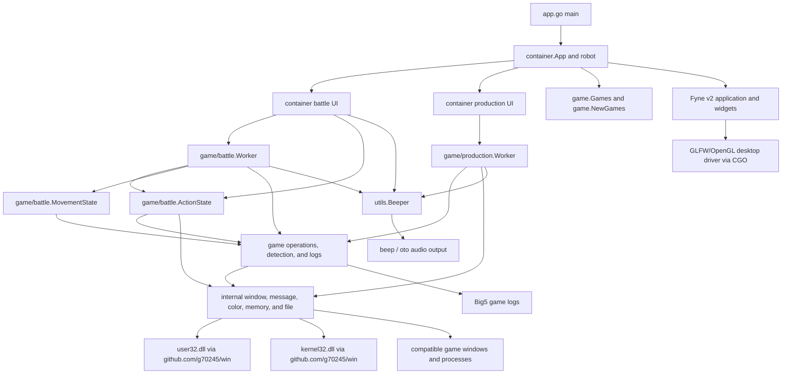
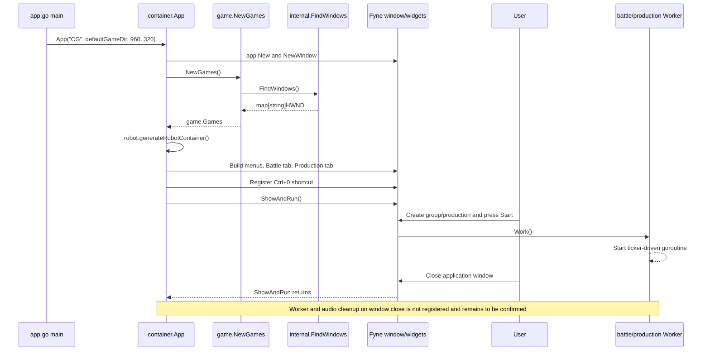
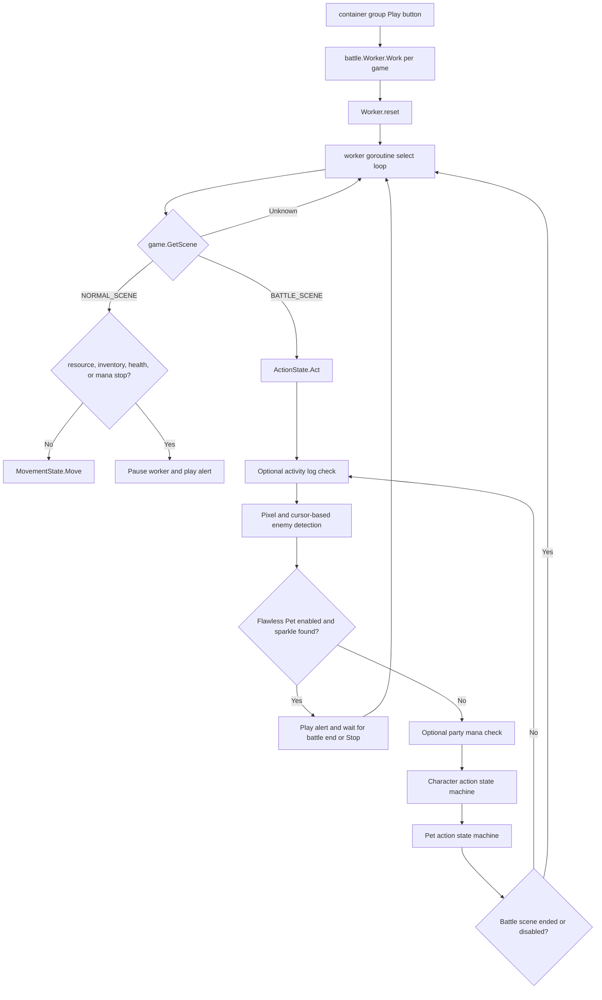
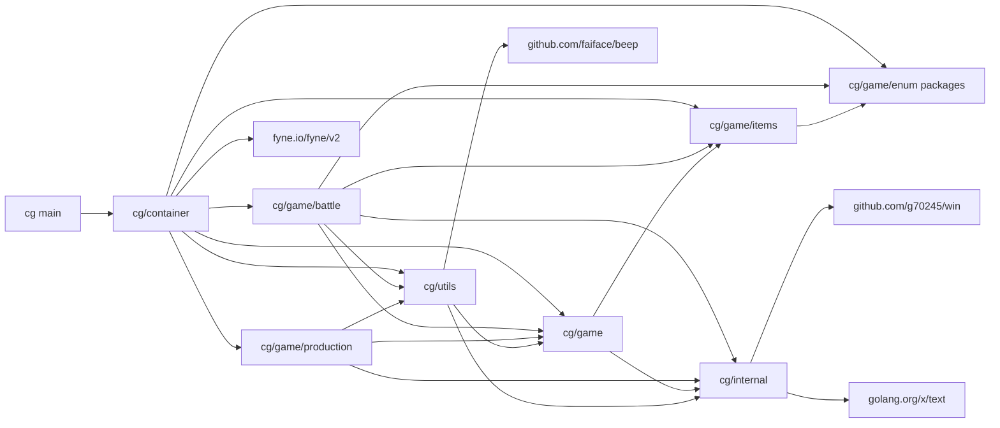

# Architecture

## 1. Project Overview

`cg` is a Windows-only desktop automation application for controlling multiple compatible game-client windows. It provides a Fyne GUI for discovering game windows, grouping them, configuring ordered battle actions, moving characters between battles, monitoring selected game conditions, and assisting with repetitive item production.

The intended users are operators who run one or more compatible game clients on the same Windows machine and want semi-automated battle and production workflows. The repository does not identify the game by name, so game-specific claims in this document are limited to behavior visible in the code.

The application interacts with the game through four mechanisms:

- It enumerates windows whose class matches `^Blue$|^Sandbox:CG\d+:Blue$`.
- It sends mouse and keyboard window messages to discovered `HWND` values.
- It samples pixels at fixed client coordinates to infer UI and battle state.
- It reads fixed process-memory addresses and parses recent Big5-encoded game logs for selected checks.

The main features currently implemented are:

- Multi-window discovery, aliasing, refresh, and grouping.
- Configurable character and pet battle-action state machines.
- Optional movement patterns based on process-memory map coordinates.
- Inventory, teleport, resource, activity, verification, health, mana, and flawless-pet encounter checks.
- Semi-automatic material preparation, production, and inventory compaction.
- Repeating MP3 alerts when operator attention is required.
- JSON-based loading and saving of battle action configurations as `.ac` files.

The application targets Windows x64. Its primary technologies are Go, Fyne, CGO-backed GLFW/OpenGL integration, Win32 APIs, and the `beep` audio stack.

## 2. Technology Stack and External Dependencies

### 2.1 Go module dependencies

`go.mod` declares module `cg`, Go `1.21.1`, and the following direct dependencies.

| Dependency | Declared version | Actual use |
| --- | --- | --- |
| `fyne.io/fyne/v2` | `v2.4.0` | Application/window lifecycle, containers, widgets, dialogs, file/folder selection, data binding, themes, canvas objects, and desktop shortcuts. |
| `github.com/faiface/beep` | `v1.1.0` | MP3 decoding, looping playback, playback control, and speaker output in `utils/beeper.go`. |
| `github.com/g70245/win` | `v0.0.0-20250117095612-913c9f118832` | Win32 types and calls for window discovery, messages, device contexts, pixels, and process-memory access. |
| `golang.org/x/exp` | `v0.0.0-20230905200255-921286631fa9` | `maps.Keys`, `maps.Values`, and `slices.Contains` in game collection, UI selection, and diagnostic code. |
| `golang.org/x/text` | `v0.13.0` | Big5 decoding for game logs and strings read from game memory. |

Important indirect dependencies include:

| Dependency group | Actual role |
| --- | --- |
| `github.com/go-gl/gl` and `github.com/go-gl/glfw/v3.3/glfw` | Fyne's desktop rendering and window driver. The Windows GLFW package contains CGO files. |
| `github.com/hajimehoshi/go-mp3` and `github.com/hajimehoshi/oto` | MP3 decoding and Windows audio output beneath `github.com/faiface/beep`. |
| Fyne rendering, text, image, storage, and systray modules | Transitive implementation details of the Fyne UI stack. |

`go.sum` pins checksums for direct and transitive Go modules. No `replace` directives or private module proxies are configured in the repository.

### 2.2 Operating-system dependencies

| Dependency | Usage | Lifecycle or permission notes |
| --- | --- | --- |
| Windows desktop APIs | The application is not portable because it relies on Windows window handles and system calls. | Supported Windows versions are **To be confirmed**. |
| `user32.dll` through `github.com/g70245/win` | `EnumChildWindows`, `GetClassNameW`, `GetWindowThreadProcessId`, `GetDC`, `GetPixel`, `ReleaseDC`, `PostMessageW`, and virtual-key mapping. | The code sends messages directly to other process windows. |
| `kernel32.dll` through `github.com/g70245/win` | `OpenProcess` and `ReadProcessMemory`. | `internal/readMemory` requests access mask `0x1F0FFF`; required privileges and cross-integrity behavior are **To be confirmed**. |
| Windows graphics stack | Used indirectly by Fyne's GLFW/OpenGL desktop driver. | Exact runtime driver requirements are managed by Fyne and are not documented in this repository. |
| Windows audio stack | Used indirectly by `beep` through `oto`. | Audio device requirements and failure behavior are **To be confirmed**. |
| Compatible game client | Supplies matching windows, fixed-size UI, memory layout, and Big5 logs. | Client name, supported versions, permissions, and layout assumptions are **To be confirmed**. |

### 2.3 Build-tool dependencies

| Tool | Confirmed requirement |
| --- | --- |
| Go | `go.mod` declares `1.21.1`; repository documentation supports the Go `1.21.x` line and records verification with `1.21.13`. |
| CGO | The verified environment reports `CGO_ENABLED=1`. It is required by the Windows GLFW package used by Fyne. |
| GCC | Required to compile the CGO-backed Fyne desktop stack. The documented and verified compiler is MSYS2 MinGW-w64 GCC `16.1.0`. |
| MSYS2 MinGW-w64 | The repository-documented provider of the Windows x64 GCC toolchain. |
| PowerShell | Required by `scripts/build.ps1` and `scripts/package.ps1`. |
| Fyne CLI | `scripts/package.ps1` invokes `fyne.io/tools/cmd/fyne@v1.7.2` through `go run`; it is not an application runtime dependency. |

### 2.4 Runtime dependencies

The built application requires Windows, a compatible game client, and access to an audio device when alerts are used. The validated display environment is a 1920×1080 desktop with Windows display scaling set to 100% and a 640×480 game client-coordinate layout. Other resolutions and scaling percentages are outside the current support scope. Battle and production automation also depend on the game client retaining the expected window class, colors, keyboard shortcuts, memory addresses, and Big5 log behavior. These client-specific compatibility constraints are intentionally encoded as constants rather than negotiated at runtime.

## 3. Repository Structure

```text
cg/
├── app.go                         # Executable entry point
├── go.mod / go.sum                # Go module definition and checksums
├── cmd/cg-helper/                 # Live-window diagnostics and editable scratchpad
├── container/                     # Fyne UI and workflow coordination
├── game/
│   ├── battle/                    # Battle state machine, detection, movement, workers
│   ├── production/                # Production workflow, detection, workers
│   ├── enum/                      # UI/domain enumerations
│   ├── items/                     # Known item definitions and colors
│   └── *.go                       # Shared game operations, detection, logs, instances
├── internal/                      # Win32, memory, color, and file primitives
├── utils/                         # Audio alerts
├── scripts/                       # Windows build and Fyne packaging scripts
├── docs/                          # Build, progress, and architecture documentation
├── .codex/skills/session-handoff/ # Project-local Codex handoff workflow
├── app.png                        # Fyne packaging icon
├── example1.png / example2.png    # Full and compact Battle UI screenshots
└── dist/                          # Ignored generated executables
```

| Path | Responsibility | Notes |
| --- | --- | --- |
| `app.go` | Calls `container.App`. | Uses title `CG`, derives the initial directory from `%USERPROFILE%\Documents\CG`, and sets window size `960×320`. |
| `cmd/cg-helper/main.go` | Provides commands to list compatible HWND values and capture a 640×480 client-area PNG. | `capture` requires an explicit decimal handle; the tool is separate from the application entry path. |
| `cmd/cg-helper/scratch.go` | Retains the developer-owned scratchpad for temporary coordinate, pixel, hotkey, and goroutine experiments. | Invoked through `go run ./cmd/cg-helper scratch`; machine/session-specific values and edits are intentional. |
| `container/main.go` | Creates the Fyne application, global window, root tabs, refresh controls, path/audio selectors, and shutdown closures used during refresh. | Contains package-level `window` and `r`. |
| `container/battle.go` | Creates battle groups and workers and coordinates group shutdown. | Keeps battle-group lifecycle separate from editor and menu composition. |
| `container/battle_action_editor.go` | Builds each game's action editor and coordinates its selector dialogs. | Retains the existing stateful editor callback flow without adding an abstraction layer. |
| `container/battle_group_menu.go` | Builds group-level battle, monitoring, target-priority, and configuration controls. | Applies shared controls across the group's workers. |
| `container/battle_tags.go` | Renders character and pet action summaries as colored tags. | Preserves the internal `*` and `**` action classifications. |
| `container/action_config.go` | Reads and writes `.ac` JSON action configurations. | Keeps persistence errors contextual and separate from dialog wording. |
| `container/setup_config.go` | Validates log/audio setup and shows shared battle/production reminders. | Used by both battle and production UI paths. |
| `container/production.go` | Builds production UI and creates/removes one production worker per selected game. | Directly controls concrete `production.Worker` values. |
| `game/instance.go` | Represents discovered windows as `Games map[string]win.HWND`. | Initial keys are decimal handle strings; UI aliases mutate this map in memory only. |
| `game/operation.go` | Provides timed, game-level input operations such as opening windows, using skills, and using items. | Delegates to `internal/message.go`. |
| `game/detection.go` | Shared scene, inventory, item, map-name, and map-position detection. | Uses fixed pixels, captured RGBA buffers, and fixed memory addresses. |
| `game/log.go` | Searches recent Big5 game logs for time-bounded phrases. | Does not expose errors to callers. |
| `game/battle/` | Implements battle actions, control units, target selection, health/mana checks, movement, and worker scheduling. | Dominated by `ActionState` and `Worker`. |
| `game/production/` | Implements material unpacking, production-state detection, inventory tidying, and worker scheduling. | Operates by fixed coordinates and colors. |
| `game/enum/` | Defines action, role, target-order, movement, ratio, offset, threshold, and control-unit values. | Primarily feeds UI selectors and state-machine configuration. |
| `game/items/` | Defines known bomb and potion colors. | Item detection is pixel-color based. |
| `internal/window.go` | Enumerates game windows by class-name regex. | Calls Win32 through `github.com/g70245/win`. |
| `internal/message.go` | Sends mouse and keyboard window messages with fixed sleeps. | Uses a dot import of the Win32 package. |
| `internal/color.go` | Reads a pixel from a target window device context. | Pairs `GetDC` with `ReleaseDC`. |
| `internal/capture.go` | Copies a client-area rectangle into a Go RGBA image through GDI. | Restores selected objects and releases the source DC, memory DC, and bitmap on every path. |
| `internal/memory.go` | Reads strings and `float32` values from another process. | Opens and closes a process handle around every read; open failures return zero-filled data. |
| `internal/file.go` | Finds the newest log file, reads trailing lines, and decodes Big5. | Returns contextual errors for missing or unreadable logs and safely handles empty files. |
| `utils/beeper.go` | Owns global looping MP3 playback. | Uses a synchronized audio-session lifecycle with error-returning initialization and fake-session test seams. |
| `scripts/build.ps1` | Verifies Go/GCC/modules and builds `dist\cg.exe`. | Supports skipping module download. |
| `scripts/package.ps1` | Runs pinned Fyne packaging with the required app ID and moves `CG.exe` to `dist\CG.exe`. | Uses `com.github.g70245.cg`. |
| `.github/workflows/windows-ci.yml` | Runs the verified Windows build, package compilation checks, and vetting on GitHub Actions. | Uses `windows-2022`, Go `1.21.x`, CGO, and GCC. |
| `app.png` | Repository-owned package icon. | Used only by `scripts/package.ps1`. |
| `example1.png`, `example2.png` | Screenshots of the full and compact Battle UI. | Referenced by `README.md`; not embedded into the executable. |
| `dist/` | Generated build output. | `*.exe` is ignored by `.gitignore`. |

There are no repository configuration files for standalone linting, installers, runtime settings, or persisted user preferences. GitHub Actions CI is configured in `.github/workflows/windows-ci.yml`.

## 4. Overall System Architecture

The current architecture is package-layered by directory, but the boundaries are pragmatic rather than interface-driven. `container` is both the UI layer and the application coordinator. `game/battle` and `game/production` contain long-running workflows. `game` provides shared game semantics. `internal` provides low-level OS and file primitives.



### Current layer responsibilities

- **UI and coordination:** `container` constructs Fyne objects, stores application-global state, creates concrete workers, edits worker state directly, and starts/stops workflows from callbacks.
- **Workflow execution:** `game/battle.Worker` and `game/production.Worker` run ticker-driven goroutines. `game/battle.ActionState` is a configurable state machine executed during battle scenes.
- **Game integration:** `game` and its subpackages translate game concepts into fixed coordinates, colors, keys, timings, phrases, and memory offsets.
- **Native integration:** `internal` translates operations into Win32 calls and local filesystem reads.
- **Configuration and state:** Runtime state is held in package globals, maps, worker structs, pointers, and Fyne widgets. Battle action configuration alone can be persisted as JSON `.ac` files.
- **Data access:** The application reads game window pixels, game process memory, game log files, MP3 files, and `.ac` configuration files. It writes `.ac` configuration files and standard-library log output.
- **Background work:** Battle workers, production workers, dialog sequencing, delayed configuration notices, and audio playback use goroutines.

## 5. Startup Flow

### 5.1 Confirmed sequence

1. `main.main` reads `%USERPROFILE%`, derives `%USERPROFILE%\Documents\CG`, and passes it to `container.App("CG", gameDir, 960, 320)`.
2. `container.App` calls `app.New`, creates a Fyne window, and resizes it.
3. It initializes the package-global `robot`:
   - `game.NewGames()` calls `internal.FindWindows()`.
   - `internal.FindWindows()` enumerates child windows under desktop handle `0` and keeps class names matching `CLASS_PATTERN`.
   - `gameDir` stores the initial directory behind synchronized accessors; `actionDir` copies its initial value.
4. `robot.generateRobotContainer` creates empty Battle and Production tabs for the discovered games. No battle or production worker goroutine starts at this point.
5. `container.App` creates Refresh Games, Alert Music, Game Folder, and the Battle-only compact-view control.
6. It registers `Ctrl+0` as a desktop shortcut that calls `utils.Beeper.Stop()`.
7. It sets the root content and calls `window.ShowAndRun()`, which owns the Fyne event loop until the window exits.



### 5.2 Configuration initialization

There is no general configuration file. `app.go` reads `%USERPROFILE%` and derives `%USERPROFILE%\Documents\CG` as the initial game/action directory without creating it. The user may replace `r.gameDir` through a folder dialog; cancelling or failing that selection preserves the current directory, while `r.actionDir` remains the initial default. Battle action settings are loaded only when the user selects an `.ac` file. Audio is initialized only after the user selects an MP3 file.

### 5.3 Background startup and shutdown

Workers start only through Play buttons. `Work()` resets existing tickers and starts a goroutine. Refresh explicitly calls `r.close()`, which removes UI objects, closes battle-group stop channels, and signals production workers. Deleting a battle group or production selection also signals its workers.

There is no `SetCloseIntercept`, application shutdown callback, or deferred call to `r.close()`/`utils.Beeper.Close()` around `ShowAndRun`. Therefore explicit cleanup on normal window close is not present in repository code. Fyne's own cleanup behavior is external to the repository; application-worker cleanup remains **To be confirmed**.

## 6. Core Functional Flows

### 6.1 Game discovery and refresh

**Trigger:** Application startup or confirmation in the Refresh dialog.

**Call chain:**

```text
container.App / robot.refresh
  -> game.NewGames
  -> internal.FindWindows
  -> win.EnumChildWindows
  -> win.GetClassName
  -> game.Games.AddGames (refresh only)
  -> robot.generateRobotContainer
```

`internal.FindWindows` converts each matching `HWND` to a decimal string key. `Games.AddGames` preserves aliases for handles that still exist, removes missing handles, and adds newly discovered handles. Refresh first removes current UI content and calls the existing `r.close`, then rebuilds tabs from the updated map.

Failure handling is minimal: Win32 return values are not checked, regex compilation occurs during each enumeration callback, and an empty result produces an application with no selectable game windows. No error is shown to the user.

**Output:** Rebuilt Battle and Production tabs backed by the current in-memory `game.Games` map.

### 6.2 Battle group configuration and execution

**Trigger:** The user creates a group, selects windows, configures actions/checkers/movement, and presses the group Play button.

**Configuration flow:**

1. `newBattleContainer` opens a Fyne dialog containing a group name and `CheckGroup` of `Games.GetSortedKeys()`.
2. `newBatttleGroupContainer` creates one `game/battle.Worker` per selected `HWND`. Workers share:
   - `sharedStopChan`
   - `sharedWaitGroup`
   - `sharedInventoryStatus`
   - a synchronized `ManaChecker` selection

The Battle-only compact view temporarily replaces the normal root content, preserves the group tabs, and reduces each group to its existing start/stop control plus a full-view restore control. The window keeps a minimum compact width for title-bar dragging while its height follows the compact content. Returning to the full view restores the normal application content and configured window size. Production does not expose this mode.
3. `generateGameWidget` updates synchronized worker configuration for movement, enemy order, and actions. Each `Work` call uses a deep action snapshot so UI edits cannot mutate an executing state machine.
4. Character and pet actions are appended in UI order. Optional parameters, offsets, thresholds, success/failure `ControlUnit` values, and jump IDs are collected through sequenced dialogs.
5. Save marshals an `ActionState` snapshot; load unmarshals JSON and replaces worker configuration through its synchronized API. Runtime-only dependencies are attached to the execution snapshot.

Magic Baby uses random encounters on normal maps and turn-based party battles. Party windows can leave the battle scene at different times. `sharedWaitGroup` deliberately tracks party members still executing battle actions: a character already back in the normal scene waits before moving so the leader cannot trigger another encounter while teammates remain in battle.

**Execution flow:**



`ActionState` transforms configured action records into mouse/key operations. It detects stages and results by pixels, changes action IDs according to `StartOver`, `Continue`, `Repeat`, or `Jump`, and resets IDs after battle. Targeting and healing inspect fixed player/enemy coordinates. Movement reads current map coordinates from process memory and clicks a point around the 640×480 center.

Bomb and potion actions locate items by capturing the current 640×480 client area once and scanning the 5×4 inventory slots at single-pixel granularity in the resulting RGBA buffer. The scan preserves the existing slot order and skips a slot when it encounters the disabled-item color. If client-area capture fails, item lookup logs the failure and falls back to the existing per-pixel window scan with the previous granularity of two for bombs and three for potions.

The optional Flawless Pet checker runs after enemy detection and before mana and action processing. For each detected enemy, it scans the inclusive 65×29 area from `(X-38, Y-10)` through `(X+26, Y+18)` for the configured sparkle color. This area covers the moving, blinking star effect rather than a fixed monster-body pixel. The checker performs five complete scans separated by 50 ms, with no delay after the final attempt. Each attempt captures the current 640×480 client area once and scans every detected enemy region in the resulting RGBA buffer; out-of-bounds region coordinates are clipped to the image. If capture fails, that attempt falls back to the existing per-pixel window scan and later attempts retry capture. A match starts the repeating audio alert and keeps that window out of its battle action state machines until the battle scene ends or the worker is stopped.

Independent ticker cases check inventory, map/log teleport state, resource phrases, and verification phrases. When a stop condition occurs, tickers stop and audio is requested.

**Failure points and handling:**

- Missing pixel pivots or action windows generally produce `log.Printf` messages and state-machine failure transitions.
- Invalid or stale memory addresses produce no explicit error; the Win32 wrapper result is consumed directly.
- Missing or invalid log paths return contextual filesystem errors and runtime phrase checks safely report no match.
- MP3 open, decode, speaker-initialization, and cleanup failures return contextual errors; selection failures are shown without terminating the process.
- Action-configuration load/save callbacks use the Fyne-provided streams, close them on every path, and show contextual errors without replacing the current state after a failed load or terminating the process after a failed save.
- A stopped ticker does not itself terminate the goroutine; the worker remains blocked in `select` until a stop-channel event or a ticker is reset.

**Output:** Window messages sent to game clients, logs written to the process logger, optional audio alerts, and action tags/configuration changes shown in the Fyne UI.

### 6.3 Production workflow

**Trigger:** The user selects games under Add Production and presses a worker Play button.

**Call chain:**

```text
container.newProductionContainer
  -> newProductionWorkerContainer
  -> production.NewWorker
  -> production.Worker.Work
  -> prepareMaterials
  -> produce
  -> tidyInventory
```

`production.Worker.Work` starts four tickers:

- A 400 ms work ticker runs the production cycle unless `GatheringMode` is enabled.
- A 2 s log checker calls `game.IsProductionStatusOK`.
- A 16 s inventory checker calls `game.IsInventoryFullWithoutClosingAllWindows`.
- A 4 s audible-cue checker alerts when `ManualMode` is set.

`prepareMaterials` opens the inventory, finds the inventory pivot by pixel color, and double-clicks material stacks from the bottom row into empty top-row slots. `produce` finds the production inventory, transfers candidate inputs, checks the production button color, starts production, and polls until the success pixel appears. `tidyInventory` compacts occupied slots leftward across two rows.

Failures generally set `ManualMode = true` and log a message. A later audible-cue tick stops all tickers and calls `utils.Beeper.Play()`. Inventory-full and log-check failures stop tickers immediately and alert. Production duration varies by item type and level, so completion polling has no fixed timeout. The polling loop also receives the worker stop channel, allowing the operator to cancel a production wait whose expected pixel never appears.

**Output:** Game-window input, process logs, optional audio alerts, and Play/Stop icon changes initiated by the UI callback. Worker failures do not update the button icon automatically.

### 6.4 Alert music selection and playback

**Trigger:** The user selects an MP3 file, or a worker detects a condition requiring attention.

`container.App` calls `utils.Beeper.Init(path)`. `Init` serializes lifecycle changes, closes any prior session, opens and decodes the MP3, initializes the global speaker, and installs a paused looping session. `Play` and `Stop` update the session under synchronization, `Close` is idempotent, and `Ctrl+0` invokes `Stop`.

Open, decode, speaker-initialization, and cleanup failures return contextual errors inside the audio subsystem. The file-selection callback maps them to a concise path-free initialization message and changes the music icon only after success. Calling `Play`, `Stop`, or `Close` before initialization is safe, and cancelling the file dialog preserves the current session.

## 7. Package and Module Dependencies



Go's compiler-enforced import graph is acyclic. The current graph has no import cycle, but several coupling characteristics matter:

- `container` depends directly on concrete `battle.Worker`, `production.Worker`, `ActionState`, enum packages, item definitions, `utils.Beeper`, and Fyne. UI callbacks directly mutate worker fields.
- `game/battle` combines scheduling, state-machine policy, detection, input operations, log checking, audio alerts, and group coordination.
- `game/production` combines scheduling, UI-state inference, input operations, and alert policy.
- `game` depends on `internal` directly; there are no interfaces separating game behavior from Win32, memory, pixels, time, or filesystem access.
- `cmd/cg-helper` depends on `game` and `internal` for intentionally retained live-window diagnostics. As an executable leaf package, it does not broaden the runtime packages' dependency surface.
- Windows integration is physically isolated in `internal`, but its concrete functions are called directly. It is a package boundary, not a replaceable abstraction.

## 8. Key Types and Components

| Name | Package | Responsibility | Main dependencies | Main callers | Notes |
| --- | --- | --- | --- | --- | --- |
| `robot` | `container` | Holds root UI, directories, dimensions, discovered games, refresh cleanup, and the Battle compact-view bridge. | Fyne, `game.Games` | `container.App` | Stored in package-global `r`; not persisted. |
| `BattleGroups` | `container` | Tracks group stop channels, compactable group views, and current compact state. | Fyne containers, `chan bool` | `newBattleContainer`, `robot.generateRobotContainer` | `stopAll` closes channels without tracking goroutine completion. |
| `ProductionWorkers` | `container` | Tracks production UI containers and stop channels by game key. | Fyne containers, `chan bool` | `newProductionContainer`, `robot.generateRobotContainer` | UI management and worker lifecycle are combined. |
| `Games` | `game` | Maps aliases/handle strings to `win.HWND`; supports refresh and selection. | `internal.FindWindows`, `x/exp/maps` | `container`, worker factories | Alias state exists only in memory. |
| `CheckTarget` | `game` | Represents a client-coordinate pixel target and expected color. | `win.COLORREF` | Detection and action code | Core representation for fixed-layout automation. |
| `ActionState` | `game/battle` | Stores ordered character/pet actions and executes the battle state machines. | `game`, enums, items, `internal`, logs, `utils.Beeper` | `battle.Worker`, battle action editor/menu, `.ac` persistence | Mixes persisted configuration with transient execution state. |
| `CharacterAction` | `game/battle` | Configures one character action and its control transitions. | Action/offset/threshold/control enums | `ActionState`, UI JSON load/save | Exported fields are serialized without an explicit version field. |
| `PetAction` | `game/battle` | Configures one pet action and its control transitions. | Action/offset/threshold/control enums | `ActionState`, UI JSON load/save | Same compatibility concern as `CharacterAction`. |
| `Worker` | `game/battle` | Schedules battle, movement, inventory, and log/memory checks for one window. | `ActionState`, `MovementState`, tickers, synchronized group state, shared channel/WaitGroup | `container/battle*.go` | Configuration is synchronized and each run owns an action snapshot; `Work` can still start a new goroutine each time it is called. |
| `Workers` | `game/battle` | Slice of battle worker pointers. | `Worker` | Battle-group UI | Pointer identity prevents copying mutex and atomic fields after use. |
| `MovementState` | `game/battle` | Chooses a movement click based on mode, origin, and current memory position. | `game.GetCurrentGamePos`, `internal.LeftClick` | `battle.Worker` | `origin` and `hWnd` are unexported runtime state. |
| `Worker` | `game/production` | Schedules production, log, inventory, and manual-attention checks for one window. | `game`, `internal`, tickers, `utils.Beeper` | `container/production.go` | Name access is mutex-protected; manual and gathering flags are atomic. |
| `Item` and `Bombs` | `game/items` | Associate item labels with detection colors. | `enum.GenericEnum`, `win.COLORREF` | Battle action configuration and item lookup | Potion is represented only by a color constant. |
| `GenericEnum[T]` | `game/enum` | Converts typed enum lists into UI option strings. | `fmt.Sprint` | Battle UI and item definitions | Minimal generic UI adapter. |
| `beeper` / `Beeper` | `utils` | Own global looping MP3 playback and control channels. | `beep`, `mp3`, `speaker` | UI, battle workers, production workers | Session and lifecycle state are synchronized. |

There are no repository/service interfaces, controllers, or repository objects in the conventional application-architecture sense. File, memory, and Win32 access are package functions.

## 9. State Management and Lifecycle

### 9.1 Global and UI state

- `container.window` and `container.r` are package globals initialized by `container.App`.
- `utils.Beeper` is a package-global singleton initialized by `utils.init`.
- Detection targets, colors, option lists, and item lists are package-level variables/constants.
- Fyne widgets retain selection, icon, text, and dialog state. UI callbacks directly update workers and the `Games` map.
- No state is persisted automatically. Aliases, selected directories, enabled checkers, groups, and production settings are lost on exit.
- The Flawless Pet checker is a per-worker atomic runtime flag. Like the other enabled checkers, it is not part of saved `.ac` action configuration.

### 9.2 Configuration state

- `r.gameDir` is protected by `robot` getter/setter methods; workers receive the synchronized getter and observe folder-dialog changes without sharing a raw string pointer.
- `r.actionDir` is a string copied at startup and does not change with the Game Folder selector.
- `ActionState` JSON saves exported action slices and fields. Runtime fields use `json:"-"` or are unexported.
- Loading a group setting deep-copies one unmarshaled `ActionState` into each worker's synchronized configuration.
- There is no schema version, semantic validation pass, migration policy, or atomic write for `.ac` files. These files are personal, UI-generated settings that can be rebuilt when damaged, so compatibility machinery is not currently required.

### 9.3 Goroutines, channels, and timers

| Source | Lifecycle |
| --- | --- |
| `battle.Worker.Work` | Starts one select-loop goroutine and resets three reusable tickers. Exits only after receiving from `sharedStopChan`; stopped tickers leave it blocked. |
| `production.Worker.Work` | Starts one select-loop goroutine and resets four reusable tickers. Exits after receiving from its stop channel. |
| `utils.Beeper` | Does not start an application-owned control goroutine; synchronized methods manage one process-global speaker session. The speaker dependency owns its playback goroutine. |
| `activateDialogs` | Starts a goroutine that waits for UI dialog-close signals on `selectorDialogEnableChan`; it also starts a final drain goroutine. |
| `notify*Config` | Starts a goroutine, sleeps 200 ms, then shows a Fyne information dialog. |

### 9.4 Concurrency risks

The following are evidence-based risk assessments; actual failure frequency requires runtime testing.

- Worker checker/stop flags and the group inventory status use atomics. Movement, enemy-order, action, mana-checker, game-directory, and production-name access use synchronized APIs. Battle execution uses a deep action snapshot rather than UI-owned slices.
- Both worker types use an atomic running gate so repeated `Work()` calls cannot create duplicate goroutines for the same worker.
- Pausing after an alert intentionally stops ticker events without terminating the worker goroutine. The goroutine remains available until the operator acknowledges the condition with Stop, handles it, and starts the worker again when ready.
- **Inference — dialog goroutine retention:** `activateDialogs` depends on every expected dialog closure sending to the channel. Unexpected UI lifecycle paths may leave a goroutine waiting.
- `sharedWaitGroup` intentionally represents party windows still in Magic Baby's turn-based battle scene. A party member back in the normal scene waits before moving, preventing the leader from starting another random encounter while teammates are still leaving battle. `Done` is deferred around each grouped action so the count is released on every action return path.
- `sharedInventoryStatus` is a shared `atomic.Bool`.

### 9.5 Fyne thread model

Most widget changes occur in Fyne callbacks. Worker goroutines do not directly update widgets. `notifySetupConfig` creates/shows dialogs from a background goroutine after sleeping, while `activateDialogs` reconfigures a shared radio selector and shows sequenced dialogs from another background goroutine.

Fyne `v2.4.0` predates the single-UI-goroutine model and public `fyne.Do` API introduced in `v2.6.0`. The pinned desktop driver's window operations queue work through `runOnMain`, while overlay stacks and refresh queues use internal synchronization. No runtime failure is confirmed for the current dialog flows. Direct selector-field changes in `activateDialogs` remain a low-confidence concurrency concern, and both paths must be reassessed before upgrading to Fyne `v2.6.0` or later, where application-owned goroutines must dispatch Fyne calls through `fyne.Do` or `fyne.DoAndWait`.

### 9.6 Native and application resource cleanup

- `internal.GetColor` correctly calls `ReleaseDC` after `GetDC`.
- Closing an audio session stops playback, clears the speaker, and closes the MP3 streamer.
- Fyne-provided `.ac` readers and writers are closed by the action-configuration I/O helpers on success and failure paths.
- `internal.readMemory` closes each process handle after its read attempt, including read-failure paths.
- Tickers are stopped on worker-goroutine exit, but the ticker objects and worker goroutines can remain reachable through UI structures.
- Normal window close has no explicit application-level worker/audio shutdown hook.

## 10. Error Handling and Logging

### 10.1 Current behavior

The project uses several inconsistent error strategies:

- Detection and state-machine failures usually return `bool` and produce `log.Printf` output.
- Many Win32 return values and errors are ignored.
- Game-directory, action-configuration, and audio-selection callback errors are shown with concise user-facing messages; an invalid file-dialog initial location intentionally falls back to Fyne's default location.
- Action-configuration read, JSON, write, and close failures retain contextual subsystem errors while Fyne dialogs show operation-level guidance without paths or decoder details.
- Audio initialization returns errors to the file-selection UI rather than terminating the process.
- Missing or unreadable game logs return path-rich errors at the filesystem boundary; preflight validation maps them to concise path-free UI reasons, while runtime phrase checks treat unavailable logs as no match.
- Process-memory read failures are not surfaced to users.

Fyne information dialogs use feature-specific setup titles and report only the missing audio/log requirements. Error dialogs report game-directory, action-configuration, and audio-selection failures with concise actionable text. Operational worker failures are logged and may trigger audio; they are not presented as structured UI errors.

The standard `log` package writes to its default destination, normally standard error. The repository does not configure a log file, structured logging, rotation, severity fields, or redaction.

### 10.2 Important error boundaries

| Boundary | Current handling | Consequence |
| --- | --- | --- |
| Window enumeration and class lookup | Return values ignored | Missing games appear as an empty list without diagnostics. |
| Message injection | `PostMessage` results ignored | Failed input is inferred indirectly from pixels, if at all. |
| Pixel/DC reads | `GetPixel` result consumed directly | Invalid handles/DCs can resemble unexpected colors. |
| Process open/read | Open failure returns zero-filled data; read errors are not exposed by the Win32 wrapper | Handles are closed, but access failures can still resemble zero-valued state. |
| Log directory/file reads | Filesystem helpers retain contextual paths; preflight validation reports path-free missing/unreadable or empty-folder reasons; runtime phrase checks safely return no match | Invalid paths no longer terminate the application or produce unreadably long dialogs; runtime loss of logs is not surfaced in the UI. |
| `.ac` load | Reader and JSON failures retain contextual errors; the dialog reports that the selected file could not be loaded and may not be a valid `.ac` file; state changes only after a successful decode | Invalid files leave the current action configuration unchanged without exposing technical details. |
| `.ac` save | Encode, write, short-write, and close failures retain contextual errors; the dialog reports that the file could not be saved | Save failures no longer terminate the application or expose provider details. |
| Audio initialization | Open/decode/speaker errors remain contextual internally and map to one path-free dialog with MP3 and output-device guidance | Invalid audio selection leaves Beeper unconfigured without terminating the application. |
| Production completion polling | No fixed timeout because duration varies by item; Stop is received inside the polling loop | The operator can cancel an unexpected or prolonged wait. |

Logs include numeric window handles, coordinates, map names, and action status. They do not intentionally log credentials, but captured logs can contain process-specific handles and game-derived names. Logs should be treated as machine/session-specific diagnostic data.

## 11. Build and Runtime Architecture

### 11.1 Confirmed Windows development environment

- Windows x64 target.
- Go `1.21.x`; verified locally with `go1.21.13 windows/amd64`.
- `CGO_ENABLED=1` and `CC=gcc` in the verified environment.
- MSYS2 MinGW-w64 GCC on `PATH`; verified documentation records GCC `16.1.0`.
- PowerShell for repository scripts.
- Network/module-proxy access for the first dependency download and Fyne CLI resolution.

When PATH is changed, existing PowerShell processes do not automatically receive the new value. A new PowerShell window or a current-process PATH update is required. Local PowerShell execution policy may also block scripts; `docs/build-windows.md` documents a process-scoped workaround.

### 11.2 Build paths

```powershell
.\scripts\build.ps1
.\scripts\build.ps1 -SkipDependencyDownload
go run .
go test ./...
go vet ./...
```

`scripts/build.ps1`:

1. Locates Go, with `C:\Program Files\Go\bin\go.exe` as a fallback.
2. Requires `gcc` on `PATH`.
3. Requires tracked `go.sum`.
4. Optionally runs `go mod download`.
5. Runs `go mod verify`.
6. Runs `go build -trimpath -o dist\cg.exe .`.

The script prints the absolute output path and throws on detected failures. It does not run `go test`, `go vet`, formatting checks, race detection, or UI smoke tests.

### 11.3 Continuous integration

`.github/workflows/windows-ci.yml` runs on pushes and pull requests targeting `dev` or `main`, with manual dispatch available. It uses the fixed `windows-2022` runner image, Go `1.21.x`, `CGO_ENABLED=1`, and `CC=gcc`.

The workflow calls `scripts/build.ps1`, verifies `dist\cg.exe`, and runs `go test ./...` and `go vet ./...`. It does not launch the GUI, interact with a game client, package a release, or upload build artifacts.

### 11.4 Packaging

`scripts/package.ps1` invokes:

```text
go run fyne.io/tools/cmd/fyne@v1.7.2 package
```

It targets Windows, uses `app.png`, sets name `CG`, enables release mode, optionally adds `--app-version`, expects root `CG.exe`, and moves it to `dist\CG.exe`.

The currently verified Fyne CLI requires `--app-id com.github.g70245.cg`, and the script passes that application ID. Direct packaging with the same app ID is documented in `docs/build-windows.md`.

There is no installer, code signing, update mechanism, or release workflow. Cross-compilation is neither scripted nor verified. Because the target uses CGO and Windows-specific APIs, cross-compilation would require an appropriate Windows C toolchain and remains **To be confirmed**.

### 11.5 Resource handling

- `app.png` is supplied to Fyne CLI for release packaging; it is not referenced by application Go code.
- `example1.png` and `example2.png` are documentation-only.
- No resources are embedded with `fyne bundle`, `go:embed`, or a generated resource file.
- Ordinary `go build` output and Fyne packaged output are distinct even though Windows treats `CG.exe` and `cg.exe` as the same case-insensitive filename in `dist`.

## 12. Testing and Validation

### 12.1 Existing automated coverage

The repository contains focused unit tests for enum option conversion, process-handle ownership, log/filesystem behavior, log-directory validation, user-facing setup messages and action-ID validation, action-configuration I/O, and the synchronized audio lifecycle. These tests use pure values, temporary filesystem fixtures, and fake audio sessions; they do not require a live game window, process memory, user log directory, or audio device.

The following commands passed in the verified Windows environment on 2026-07-16:

```text
go test ./...
go test -race ./utils
go vet ./...
```

The existing documented build verification is `scripts/build.ps1`, which has produced `dist\cg.exe` in the current Windows environment. That proves dependency resolution and compilation in one configured environment, not runtime correctness.

### 12.2 Manual validation implied by the code and documentation

- Launch the GUI with `go run .`.
- Confirm compatible windows appear and refresh correctly.
- Configure battle actions and inspect action tags.
- Run battle and movement against live game windows.
- Load/save `.ac` files.
- Select an MP3 and trigger/stop an alert.
- Run production preparation, production, inventory tidying, and full-inventory detection.
- Package with Fyne and inspect the executable icon.

No repeatable manual test checklist or expected fixture data is stored in the repository.

### 12.3 Important untested behavior

- Action-state control transitions, jumps, and hanging behavior.
- Movement calculations and boundary decisions.
- Health, mana, target, inventory, item, and production pixel detection.
- Game-log tail reading, timestamp filtering, rotation, missing paths, short files, and Big5 decoding.
- Process-memory read errors and client-version changes.
- Worker start/stop/restart, group coordination, refresh cleanup, and application shutdown.
- Audio initialization, concurrent alerts, invalid files, and device failures.
- `.ac` schema compatibility, semantic validation, and Fyne dialog integration.
- Unsupported display resolutions or scaling percentages, minimized/covered windows, multiple monitors, and game UI variants.

Tests for these behaviors cannot safely depend on a live game, process memory, or user log directory. Future tests would first require small seams around pixel, input, memory, clock, filesystem, and audio operations.

## 13. Known Limitations and Technical Debt

Severity reflects likely operational or maintenance impact, not design-pattern compliance.

### Critical

No issue is classified as confirmed Critical from repository evidence alone. Runtime frequency, supported client versions, privilege requirements, and production usage are not known well enough to claim an immediate catastrophic defect.

### High

No remaining issue is currently classified as High.

### Medium

No remaining issue is currently classified as Medium.

### Low

| Issue | Location | Risk and current impact | Why investigate | Suggested investigation |
| --- | --- | --- | --- | --- |
| Native polling and message failures are not surfaced | `internal/window.go`, `internal/message.go`, `internal/color.go`, `internal/memory.go` | Failed window enumeration, input injection, pixel reads, and memory reads can resemble empty or unexpected game state; no reproducible user-visible failure is currently confirmed. | These operations run frequently, and reporting every transient failure would be noisy; the current Win32 wrapper also does not expose complete process-memory read errors. | Add structured error propagation only when a specific boundary has an observable failure or is otherwise being changed; stop the affected worker once instead of showing dialogs from polling loops. |
| No explicit shutdown hook | `container/main.go` | Workers/audio are stopped on refresh/removal but not on normal window close; the process currently exits with the last Fyne window, and operators commonly stop active work first. | No user-visible shutdown failure is confirmed, so adding lifecycle machinery now would be speculative. | Reassess if shutdown must persist state, wait for workers, or release resources before process exit. |
| `.ac` format is unversioned and weakly validated | `container/action_config.go`, `game/battle/action.go` | Syntactically valid JSON with invalid action values can load, but the files are personal, generated through the UI, and inexpensive to rebuild. | Public compatibility and migration guarantees are not required for the current workflow. | Reassess if files are shared, distributed, manually edited, or become expensive to recreate. |
| Background dialog sequencing relies on Fyne v2.4 concurrency behavior | `container/battle_action_editor.go:activateDialogs`, `container/setup_config.go:notifySetupConfig` | Dialogs are shown from application-owned goroutines, and `activateDialogs` directly reconfigures selector fields; no runtime failure is confirmed under the pinned pre-v2.6 toolkit. | Fyne v2.6 introduced a different single-UI-goroutine model and requires `fyne.Do` for background UI calls. | Reassess both paths during a Fyne upgrade or if a dialog race becomes observable; do not add a custom dispatcher for v2.4. |
| Game and action paths can diverge | `container/main.go` | `gameDir` can change while `actionDir` remains the initial `%USERPROFILE%\Documents\CG` value. | Game logs and saved actions may intentionally live under different selections, but the UI does not explain this. | Confirm desired path policy and persist only if users need it. |
| Empty source file | `game/map.go` | No runtime impact. | It may imply abandoned or planned functionality. | Confirm intent; remove only in a separate cleanup if truly unused. |

## 14. Current Architecture and Potential Future Direction

### 14.1 Current Architecture

The application is a compact Windows-specific desktop program with direct package calls:

- Fyne callbacks in `container` create and mutate concrete workers.
- Workers own tickers and goroutines and call concrete game/native functions.
- `ActionState` contains both battle configuration and runtime state-machine execution.
- `game` and subpackages encode client-specific coordinates, colors, timings, phrases, and memory addresses.
- `internal` provides direct Win32/filesystem primitives without interfaces.
- Shared singleton and pointer state coordinates workers; the global alert session uses explicit synchronization.
- `.ac` JSON is the only persisted application configuration.

This structure is understandable for the repository's size and avoids an unnecessary framework or service container. Its main costs are testability, lifecycle clarity, and inconsistent error boundaries rather than a lack of architectural patterns.

### 14.2 Potential Future Direction

Improvements should be incremental and driven by observed failures:

1. **Continue stabilizing error and resource boundaries.** Process handles, log reads, audio initialization, and `.ac` I/O now have explicit ownership or error handling; propagate remaining memory, Win32, and UI errors incrementally.
2. **Make worker lifecycle explicit.** Define start, pause, stop, restart, and shutdown semantics; use one idempotent termination path per worker and one application-level shutdown path.
3. **Introduce narrow test seams around volatile I/O.** Small function fields or focused interfaces for pixels, input, memory, logs, clock/tickers, and alerts would enable table-driven state-machine tests without designing a broad abstraction hierarchy.
4. **Separate persisted battle configuration from runtime state only if compatibility becomes a real requirement.** The current personal `.ac` workflow does not justify schema-versioning or migration machinery.
5. **Reduce UI coupling opportunistically.** Extract action-file load/save and stable action-editor helpers when those areas next change. Keep Fyne-specific code in `container`; do not introduce controllers or repositories without a concrete need.
6. **Automate the verified build path.** Fix packaging, add Windows CI for module verification/build/vet/tests, and add targeted tests as seams become available.

These directions favor KISS and YAGNI: retain the existing packages, add abstractions only at expensive external boundaries, and avoid a large rewrite.

## 15. Items to Be Confirmed

1. What is the official name of the compatible game, and which client versions/builds are supported?
2. Are `Blue` and `Sandbox:CG<digits>:Blue` the complete supported window-class patterns?
3. Are `MEMORY_MAP_NAME`, `MEMORY_MAP_POS_X`, and `MEMORY_MAP_POS_Y` valid for only one client version?
4. Does the application require administrator privileges or the same Windows integrity level as the game client?
5. Is broad process access mask `0x1F0FFF` intentional, or can memory access use narrower rights?
6. Should the action directory continue using the initial `%USERPROFILE%\Documents\CG` path after the user selects a different game folder?
7. What is the expected directory layout under the selected game folder, especially `Log` and `actions`?
8. Are game logs always Big5, timestamped as `[HH:MM:SS]`, and stored in files whose modification time identifies the active log?
9. What are the expected log rotation, empty-log, and midnight behaviors?
10. What phrases should `PH_PRODUCTION_FAILURE` contain? Is its current empty value intentional?
11. What is the intended semantic meaning of `IsProductionStatusOK` when it searches for the worker name plus failure phrases?
12. What are the intended user workflows for `GatheringMode` and `ManualMode`?
13. Should worker Play be restartable after an alert, and should repeated Start calls be rejected?
14. Should closing the main window wait for all worker and audio goroutines to exit?
15. Are aliases expected to persist between sessions?
16. Are all character/pet actions in the enum still supported? `character.Steal` and `pet.Protect` are defined but are not fully represented in the current UI/execution switches.
17. Are the hard-coded item colors and bomb names complete for supported clients?
18. Which Windows versions and CPU architectures are supported in practice?
19. Is the application distributed as a standalone executable, a Fyne package, or through an external installer?
20. Is code signing required for releases?
21. Is cross-compilation a requirement, or is native Windows x64 building sufficient?
22. Is the empty `game/map.go` still intentionally retained?
23. Which current behaviors are temporary workarounds for client-specific issues?
